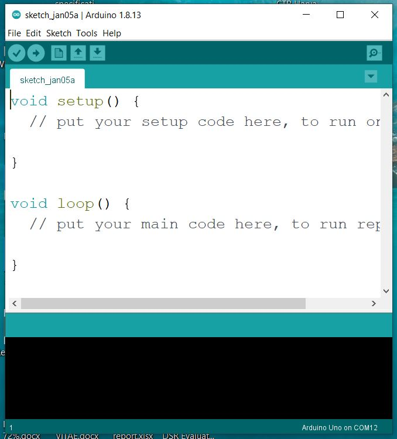
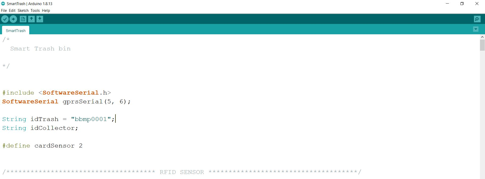
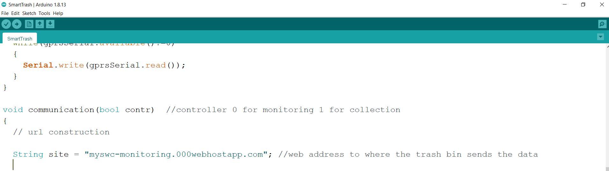

# Smart trash bin

The Smart Bin is a device designed to work with a remote web application to monitor municipal solid waste collection. It collects the level of waste inside the bin, the weight, as well as the identity of the collector when he comes to collect the waste. It has two main parts; a hardware part and a software part.

## Hardware

The hardware part of the system is made up of different components interconnected with each other in order to achieve a specific goal.

### Components used

- Arduino board
- GSM module SIM900
- HC-SR04 ultrasonic
- 20 kg load cell with HX711 amplifier
- RFID module RFID-RC522
- Push button
- 5V power supply
- Trash bin

### Interfacing 

| **Componant pin** 		| **Arduino pin** 		|
|-------------------------------|-------------------------------|
| **RFID Sensor**      		|  		               	|
| SCK               		| 13		               	|
| MISO              		| 12  		             	|
| MOSI              		| 11  		             	|
| SDA(SS)           		| 10     	          	|
| RST               		| 9      	          	|
| 3.3V				| 3.3V				|
| **HC-SR04 ultrasonic**	|         	        	|
| echoPin           		| 8       	         	|
| TriggerPin        		| 7       	         	|
| VCC				| 5V				|
| GND				| GND				|
| **GSM module**		|				|
| RX				| 6  				|
| TX				| 5				|
| Power supply			| 12V				|	
| **Load cell**        		|   	  	            	|
| Green A+ (DT)			| 4				|
| White A- (SCK)    		| 3        	        	|
| VCC				| 5V				|
| GND				| GND				|
| **Push button**		|				|
| Pin 1				| 2 (with pull up resistor)	|
| Pin 2				| GND				|

## Software

## Programming

- To program the smart trash bin, be sure to download the Arduino IDE first. You can find it on the link **https://www.arduino.cc/en/software**. 
For this smart bin we used Arduino 1.8.13

- Then Download the smart bin Arduino sketch on the link **https://github.com/conordata/SmartTrash**.

- Before uploading the code to the Arduino board, be sure to open the sketch and set the smart bin ID. 

This ID must be unique for each Smart Bin in the system and must be saved with the exact same name in the application database. Otherwise, it will not be able to send the data.

- After setting the Recycle Bin ID, you may also need to change the web address to where the Smart Recycle Bin should send data depending on where you will host your web app. 

- Connect your Arduino board to a USB port on your computer, then upload the code.
- Then go to [https://github.com/conordata/myswc](https://github.com/conordata/myswc) to configure the web app

## Resources

- Ultrasonic sensor - https://create.arduino.cc/projecthub/abdularbi17/ultrasonic-sensor-hc-sr04-with-arduino-tutorial-327ff6
- GSM module - https://lastminuteengineers.com/sim900-gsm-shield-arduino-tutorial/
- Load cell - https://circuits4you.com/2016/11/25/hx711-arduino-load-cell/
- RFID - https://lastminuteengineers.com/how-rfid-works-rc522-arduino-tutorial/

## Made with

- Arduino platform

## Author

* **ILUNGA WA LUNDA Ariel** _alias_ [@conordata](https://github.com/conordata)

 
